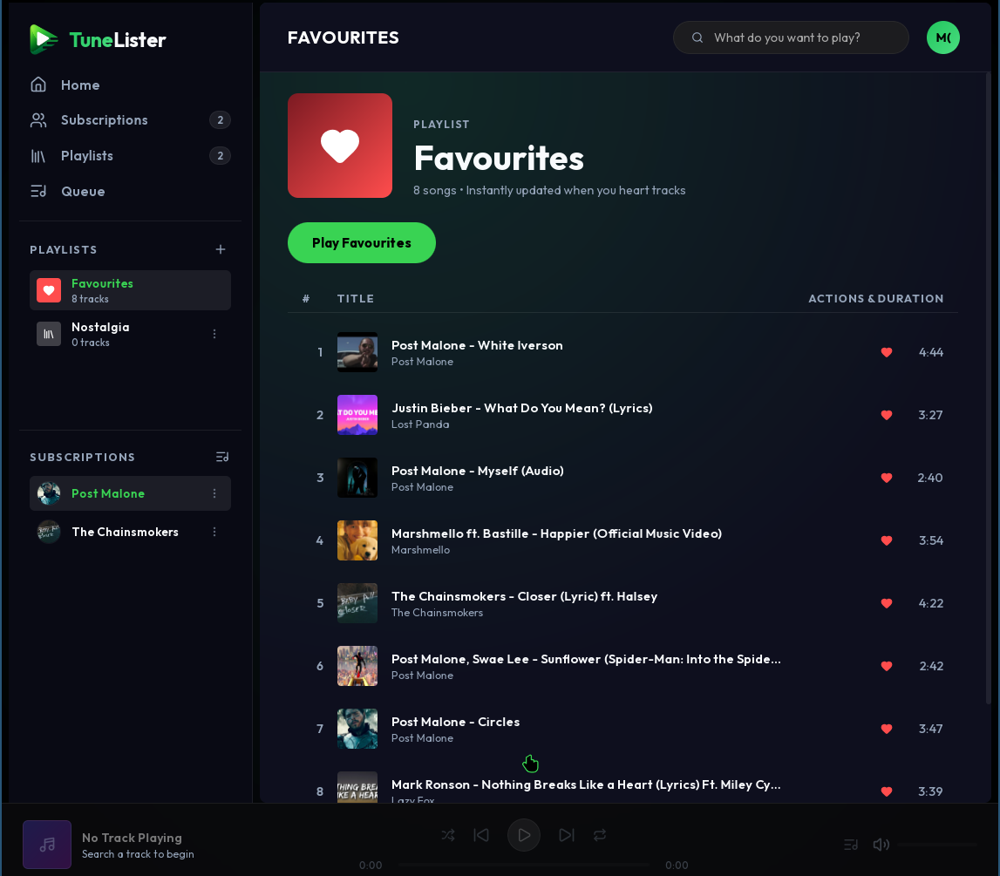
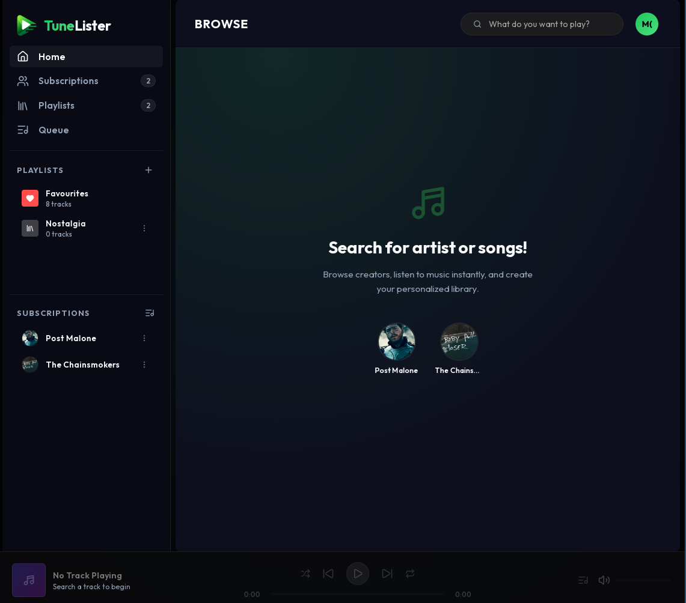
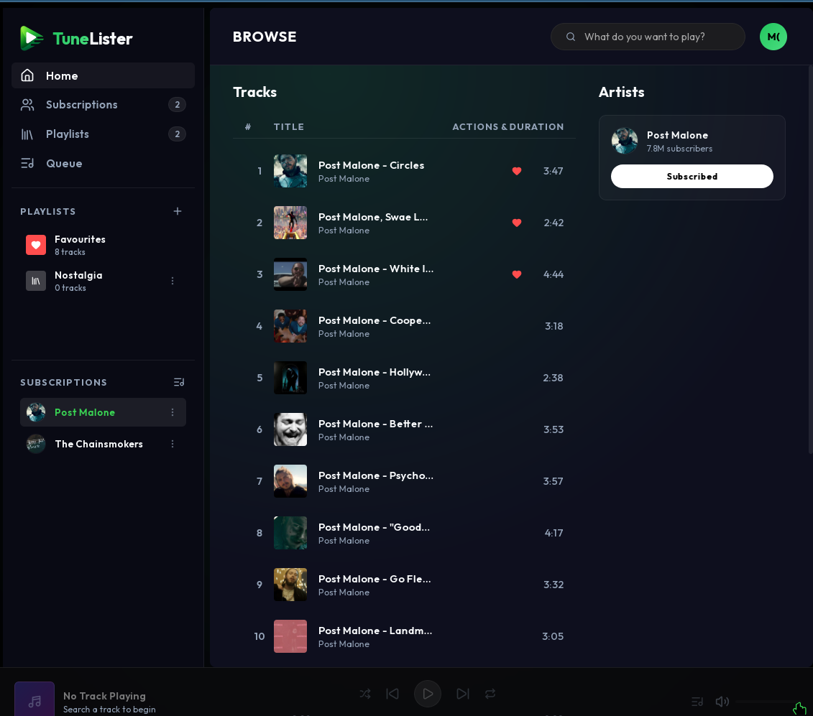
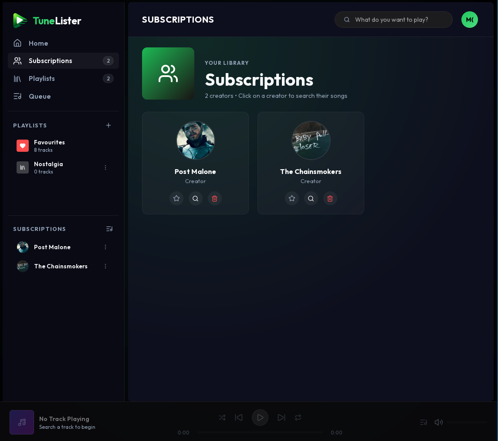
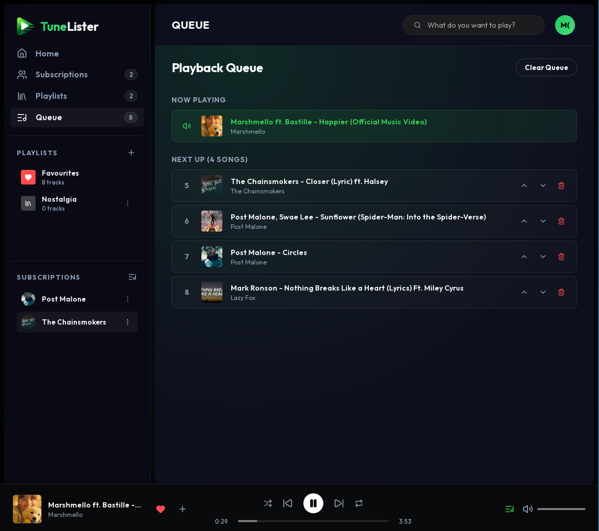

# 🎵 TuneLister

[](https://tunelister.vercel.app/)
[](https://golang.org)
[](https://reactjs.org)
[](https://github.com)

TuneLister is a premium, lightweight, standalone desktop audio streamer and manager. Built on a Go loopback server and a Webkit-based WebView GUI, it delivers a zero-latency audio streaming experience with smart local encryption, offline caching, and Google Drive cloud library synchronization.

---

## 🎨 Gallery

### 🌟 Main Dashboard (Favorites View)


### 🧩 Features & Views
| Home Screen | Search & Browse | Subscriptions | Play Queue |
| :---: | :---: | :---: | :---: |
|  |  |  |  |

---

## ⚠️ CRITICAL WARNING & DISCLAIMER

> [!WARNING]
> **PLEASE READ BEFORE USING TUNELISTER**
> 
> * **NO RECOMMENDATIONS**: TuneLister does not and will never recommend, curate, or present any creators, music, or channels to the user.
> * **NO COPYRIGHTED MATERIAL SUPPORT**: We do not host, distribute, or support the usage of copyrighted material. TuneLister does not provide any pre-loaded content or indexes.
> * **USER ACCOUNTABILITY**: TuneLister is a sandbox utility tool. The user assumes full responsibility and absolute legal liability for what they search, stream, or store. 
> * **NO WARRANTY**: This software is provided "as is" without warranty of any kind, either express or implied, including but not limited to the implied warranties of merchantability, fitness for a particular purpose, or non-infringement.

---

## ✨ Features

* **⚡ Ultra-Low Latency Streaming**: Dynamically streams and transcodes audio live with zero buffer overhead.
* **💾 Smart Local Caching**: Automatically saves and decrypts streamed tracks on subsequent plays, reducing network usage to zero.
* **☁️ Google Drive Library Sync**: Synchronizes playlists, favorites, and subscriptions to your private Google Drive AppData folder using secure OAuth2.
* **🔒 AES-256-GCM Encryption**: All local caches and session tokens are strongly encrypted locally.
* **🚀 Standalone & Portable**: Self-contained binaries with embedded frontends, running directly without installation.

---

## 🛠️ Technology Stack

TuneLister is built using a highly optimized desktop integration stack:

* **Go Backend**: Manages loopback routing, background workers, local caching, encryption, and API communication.
* **React + Vite + Framer Motion**: Provides a high-fidelity visual interface with smooth, layout-safe transitions.
* **Webview Go**: Wraps the frontend into a native window shell utilizing system WebKit/WebView runtimes.
* **yt-dlp**: Serves under-the-hood audio query extraction.
* **FFmpeg**: Handles dynamic runtime audio transcoding into compatible MP3 streams.

---

## 🚀 Installation & Build Guide

### Prerequisites

Ensure you have the following installed on your machine:
* Go (1.26.4 or higher)
* Node.js & npm (for building the React frontend)
* GCC/MinGW (for compiling CGO dependencies like WebKit bindings)

### Build Standalone Executables

1. Clone the repository and navigate to the directory:
   ```bash
   git clone https://github.com/your-repo/TuneLister.git
   cd TuneLister
   ```

2. Install frontend dependencies:
   ```bash
   cd frontend && npm install && cd ..
   ```

3. Run the Go builder pipeline:
   ```bash
   go run build.go
   ```

Upon completion, you will find ready-to-run desktop packages inside the `packages/` folder:
* **Linux Standalone Launcher**: `packages/linux/tunelister-online`
* **Windows Standalone Launcher**: `packages/windows/tunelister-online.exe`

---

## 🌐 Links

* **Home Page**: [https://tunelister.vercel.app/](https://tunelister.vercel.app/)
* **Privacy Policy**: Refer to the terms listed on the landing page regarding Google OAuth Drive scopes.
